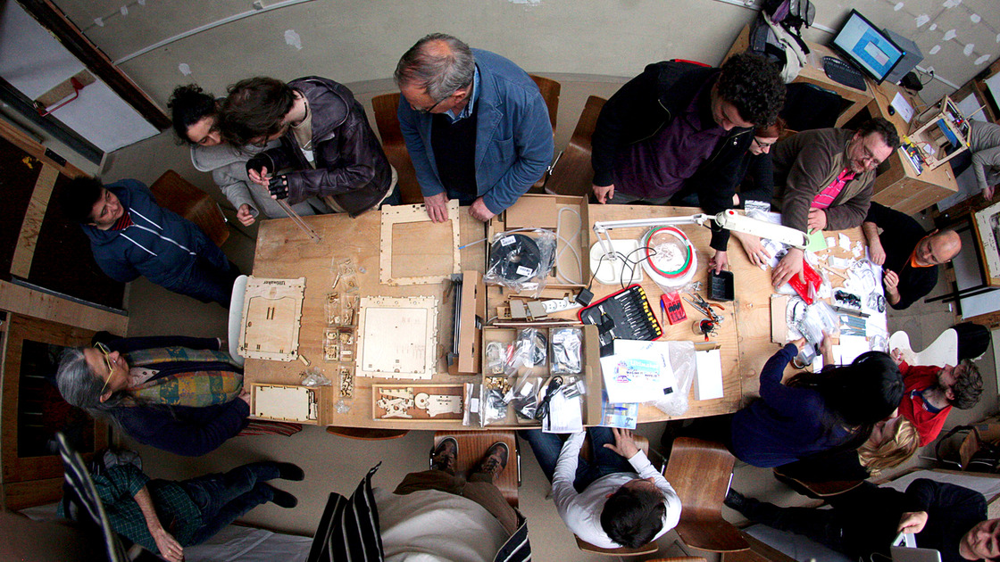
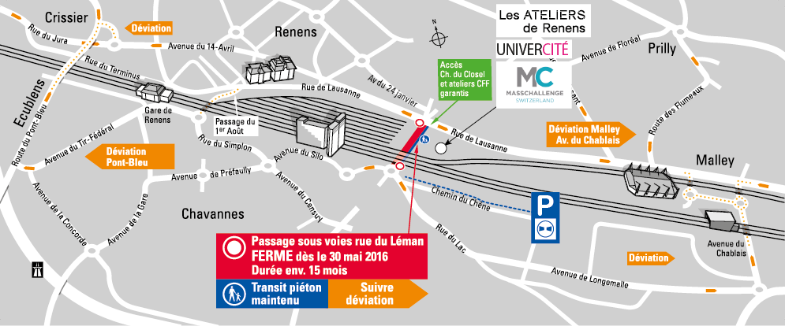

> “The Metropolis strives to reach a mythical point where the world is completely fabricated by man, so that it absolutely coincides with his desires.”
> <small>― Rem Koolhaas[^Koolhas2000]</small>

Recently, a specific type of places have sprung up over the globe to host social and technological experiments about fabrication and the act of making[^Ingold2013]. Populated by an eclectic array of people commonly called *makers*[^Anderson2014], these *makerspaces* (e.g. hackerspaces, hacklabs, fablabs, living labs...) combine multiple and sometimes contradictory visions and utopias[^Lindtner2016] about new ways of living, producing and inhabiting the world. The current workshop aims at designing methods and tools to study makerspaces, by considering actors, tools, networks, and localized practices or discourses in larger socio-economics and political contexts across multiple sites[^Marcus2009].

##### Creative spaces in cities

Studying cities has never been an easy task. Spaces are produced by imaginaries[^Soja1996], socio-political settings[^Lefebvre1991] or technologies[^DodgeKitchin2014] while places are entangled in hybrid realities[^Bhabha1994] and networks[^Graham1998]. Since its formulation 25 years ago, the hypothesis of the creative city[^Florida2002] still remains an important cornerstone of urban design and policies. In a paper called *The Anatomy of the Creative City*, Cohendet et al[^Cohendet2012] identify three layers in this creative city : the *upperground* with formal institutions (firms, companies, public services, etc), the *underground* where resides creative, artistic and cultural activities without formal production, exploitation or diffusion and more interestingly the *middleground* which constitues *"a critical intermediate structure linking the underground to the upperground"* (ibid).

The idea of *middleground* has been partly illustrated by the concept of *third places*[^Oldenburg1999], which represents social setups between home and office (cafes, libraries, events, etc). The generic term of *makerspaces* describes new forms of such third places that dedicate themselves to provide venues to the act of making, in and out the traditional contexts of work and leisure.

##### Making together and the study of assemblages

What are they? How can these makerspaces be defined? While they first exist as locations, these places are also embedded in larger urban assemblages[^McFarlane2011] of spatial, social and political networks[^FariasBender2012]. Traditional approaches in social and human sciences (ethnography, statistics, interviews, discourse analysis, etc.) provide little guidance about the conduct of studies on such fragmented and discontinued objects.

Moreover, the passive position of the observer seems to oppose to the active stance of the maker, resulting in possible conflicts in the understanding of makerspaces. What can researchers *make*? How can makers lead a research about their spaces? How can the collection, record, mapping and visualization of information become the product of a common study? What should the study of making look like?

<small>credits: Fabrique d'Objets Libres (cc)</small>

#### Prototyping and hybrid methods

The present workshop aims at bringing together makers and practitioners from different background and disciplines to design new methods, processes, protocols or tools that can support the study of local and open-ended objects. Some of these different methods may include : experimental design (fast prototyping, user testing, etc), ethnographic field work (interviews, note-taking, sketching, etc), data-based analysis (text mining, online social network mapping, etc ),  sensible approaches of urbanity (soundscapes, exploratory walks, etc)...

Here are some open questions we plan to approach during the workshop :

**HOW TO**

- Constitute a documentation of activities in a makerspace?
- Co-create research that is useful for the maker communities?
- Use websites and social networks as sources?
- Integrate interviews and field notes with findings from data-based analysis?
- Organize multiple media produced during field work (sounds, pictures, etc.)?
- Lead and record interviews based on third activity (drawings, etc.)  ?
- Record and structure networks of relationships between actors?
- Visualize and annotate maps properly to produce new representations?
- Lead workshops as forms of investigation?
- Plan the communication of the research with local communities?
- etc.

---

#### When / Where / How ?

The **18th and 19th May, 2017** at **Les Ateliers de Renens** in Renens, Switzerland.

The workshop will start on the 18th at 9am and end on the 19th at 6pm. A dinner with all participants is planned on the evening of the 17th.

It will take place in the old printing factory of Renens that host the [UniverCité](https://univercite.ch) makerspace, the [Hackuarium](http://wiki.hackuarium.ch/w/Main_Page) bio hacklab, the [FIXME](https://fixme.ch/) hackerspace - and [La Nébuleuse](http://www.lanebuleuse.ch/) brewery !

Address : Les Ateliers de Renens, 5 Chemin du Closel, Renens, Switzerland ([Google Map](https://goo.gl/maps/9mirsdcJuY12))

---

#### Who / How (to participate)?

We welcome designers, architects, makers, researchers, PhD students, and everyone interested in studying makerspaces to participate !

Please submit **before April 21st May 1st** a short text containing a brief statement (~200 words) about why you are interested in taking part in this workshop, and a short biography of yourself (1 paragraph). All proposals will be reviewed.

*Inscriptions are now closed.*

---

#### Bibliography

[^Florida2002]: Florida, R. (2002). The Rise of the Creative Class. Washington Monthly, (May), 15–25. http://doi.org/10.1111/j.1467-8691.2006.00398.x

[^Cohendet2012]: Cohendet, P., Grandadam, D., & Simon, L. (2010). The Anatomy of the Creative City. Industry & Innovation, 17(1), 91–111. http://doi.org/10.1080/13662710903573869

[^DodgeKitchin2014]: Dodge, M., & Kitchin, R. (2004). Code , space and everyday life (CASA) (Vol. 44).

[^FariasBender2012]: Farías, I., & Bender, T. (2012). Urban assemblages: How actor-network theory changes urban studies. Urban Assemblages: How Actor-Network Theory Changes Urban Studies. Routledge. http://doi.org/10.4324/9780203870631

[^McFarlane2011]: McFarlane, C. (2011). The city as assemblage: Dwelling and urban space. Environment and Planning D: Society and Space, 29(4), 649–671. http://doi.org/10.1068/d4710

[^Oldenburg1999]: Oldenburg, R. (1999). The Great Good Place. The Great Good Place. Marlowe & Company. Retrieved from http://books.google.com/books?id=0aOjHGdSKLMC

[^Bhabha1994]: Bhabha, H. K. (1994). Introduction: The location of culture. The Location of Culture, 1–18. http://doi.org/10.4324/9780203820551

[^Soja1996]: Soja, E. W. (1996). Thirdspace : journeys to Los Angeles and other real-and-imagined places. Blackwell.

[^Lefebvre1991]: Lefebvre, H. (1991). The Production of Space. (D. Nicholson-Smith, Ed.)Production (Vol. 9). Blackwell. http://doi.org/10.1027/1618-3169/a000129

[^Ingold2013]: Ingold, T. (2013). Making : anthropology, archaeology, art and architecture. Routledge.

[^Anderson2014]: Anderson, C. (2014). Makers: The New Industrial Revolution. Crown Business.

[^Lindtner2016]: Lindtner, S., Bardzell, S., & Bardzell, J. (2016). Reconstituting the Utopian Vision of Making. Proceedings of the 2016 CHI Conference on Human Factors in Computing Systems - CHI ’16, (May), 1390–1402. http://doi.org/10.1145/2858036.2858506

[^Koolhas2000]: Koolhaas, R. (2014). Delirious new york : a retroactive manifesto for Manhattan. The Monacelli Press, LLC.

[^Graham1998]: Graham, S. (1998). The end of geography or the explosion of place? Conceptualizing space, place and information technology. Progress in Human Geography, 22(2), 165–185. http://doi.org/10.1191/030913298671334137

[^Adams1998]: Adams, P. (1998). Network topologies and virtual place. Annals of the Association of American Geographers, 88(1), 88–106. http://doi.org/10.1111/1467-8306.00086

[^Marcus2009]: Marcus, G. (2009). Multi-sited Ethnography: Notes and Queries. Multi-Sited Ethnography : Theory, Praxis and Locality in Contemporary Research.
