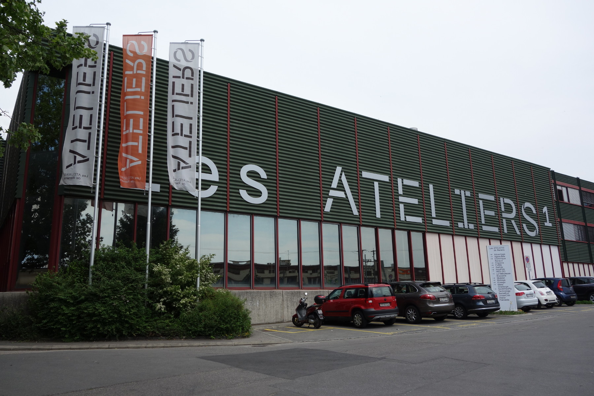
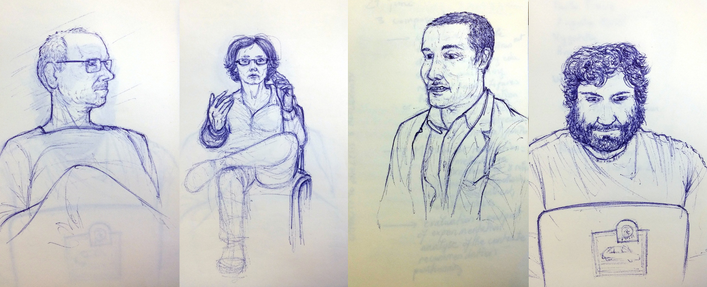
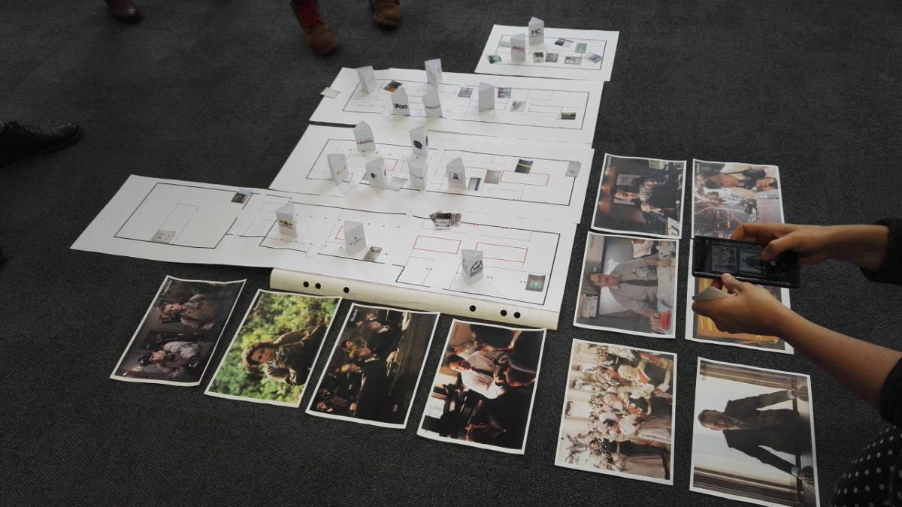
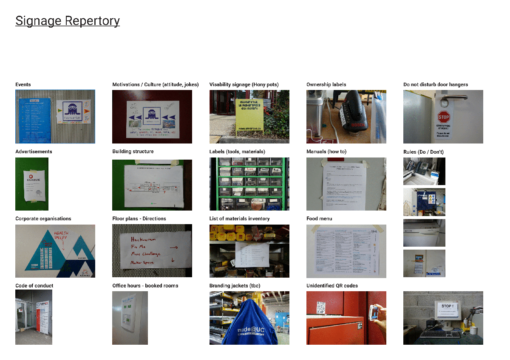
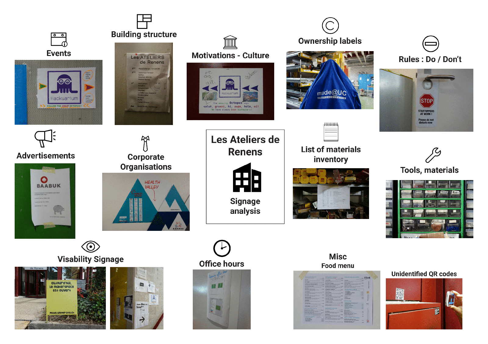
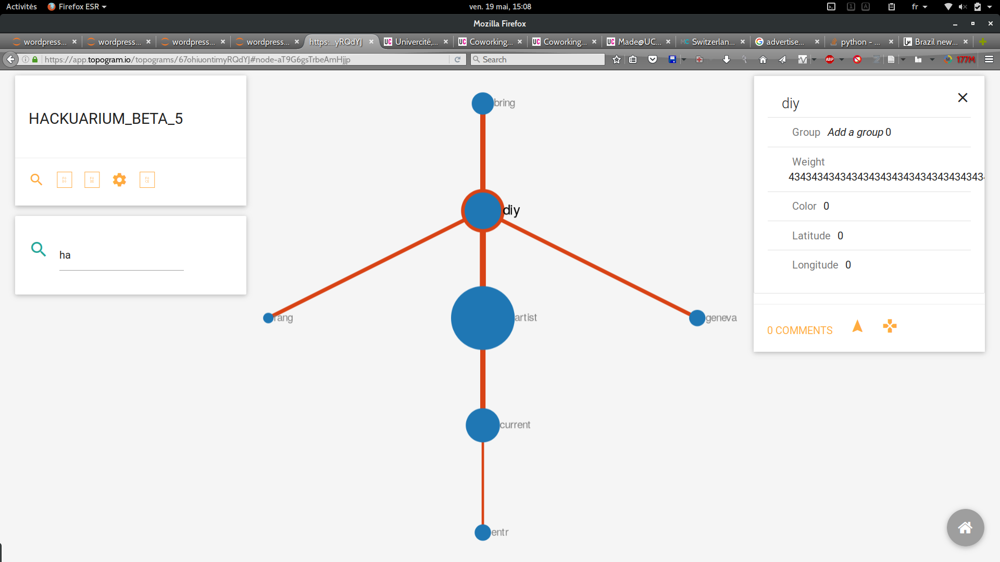
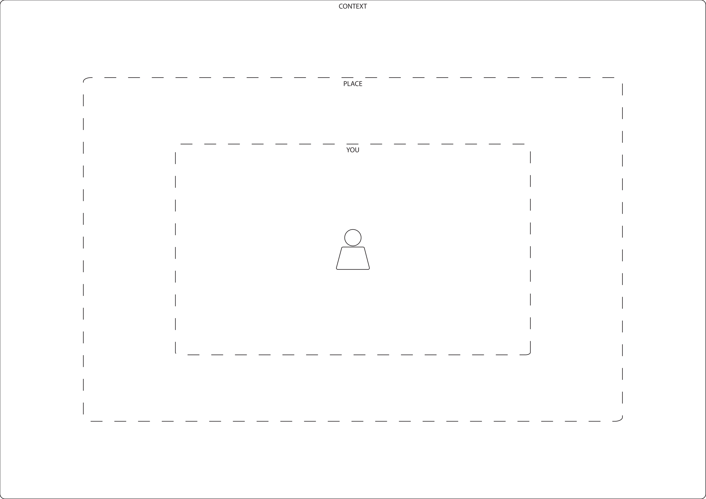
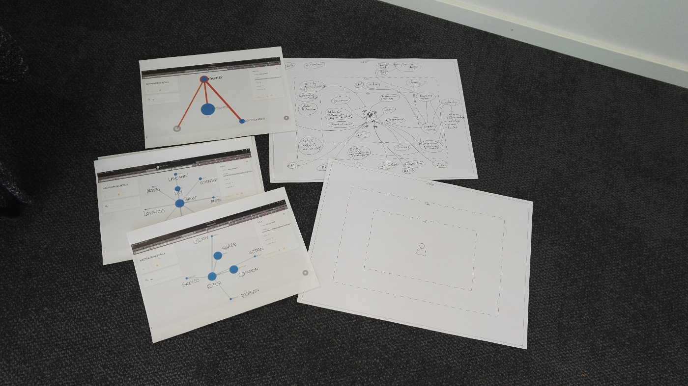
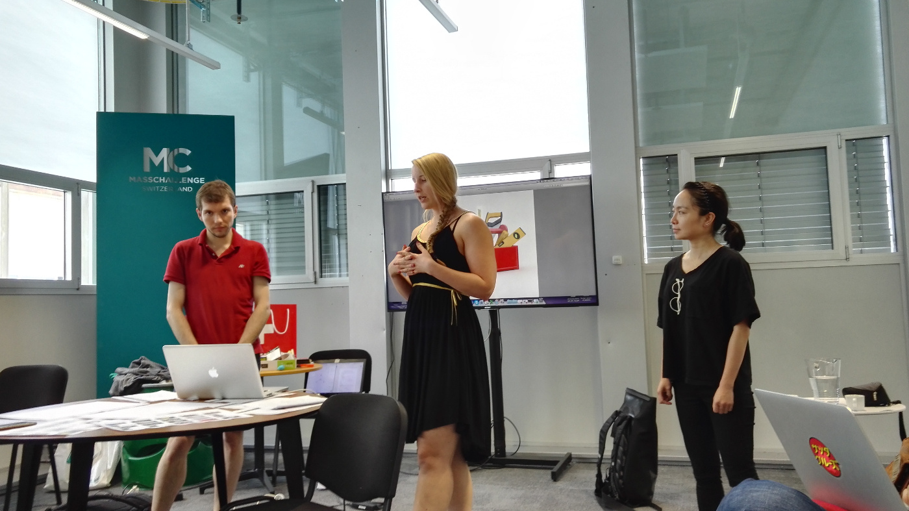

> “The Metropolis strives to reach a mythical point where the world is completely fabricated by man, so that it absolutely coincides with his desires.”
> <small>― Rem Koolhaas[^Koolhas2000]</small>

Recently, a specific type of places have sprung up over the globe to host social and technological experiments about fabrication and the act of making[^Ingold2013]. Populated by an eclectic array of people commonly called *makers*[^Anderson2014], these *makerspaces* (e.g. hackerspaces, hacklabs, fablabs, living labs...) combine multiple and sometimes contradictory visions and utopias[^Lindtner2016] about new ways of living, producing and inhabiting the world. The current workshop aims at designing methods and tools to study makerspaces, by considering actors, tools, networks, and localized practices or discourses in larger socio-economics and political contexts across multiple sites[^Marcus2009].

##### Creative spaces in cities

Studying cities has never been an easy task. Spaces are produced by imaginaries[^Soja1996], socio-political settings[^Lefebvre1991] or technologies[^DodgeKitchin2014] while places are entangled in hybrid realities[^Bhabha1994] and networks[^Graham1998]. Since its formulation 25 years ago, the hypothesis of the creative city[^Florida2002] still remains an important cornerstone of urban design and policies. In a paper called *The Anatomy of the Creative City*, Cohendet et al[^Cohendet2012] identify three layers in this creative city : the *upperground* with formal institutions (firms, companies, public services, etc), the *underground* where resides creative, artistic and cultural activities without formal production, exploitation or diffusion and more interestingly the *middleground* which constitues *"a critical intermediate structure linking the underground to the upperground"* (ibid).

The idea of *middleground* has been partly illustrated by the concept of *third places*[^Oldenburg1999], which represents social setups between home and office (cafes, libraries, events, etc). The generic term of *makerspaces* describes new forms of such third places that dedicate themselves to provide venues to the act of making, in and out the traditional contexts of work and leisure.

##### Making together and the study of assemblages

What are they? How can these makerspaces be defined? While they first exist as locations, these places are also embedded in larger urban assemblages[^McFarlane2011] of spatial, social and political networks[^FariasBender2012]. Traditional approaches in social and human sciences (ethnography, statistics, interviews, discourse analysis, etc.) provide little guidance about the conduct of studies on such fragmented and discontinued objects.

Moreover, the passive position of the observer seems to oppose to the active stance of the maker, resulting in possible conflicts in the understanding of makerspaces. What can researchers *make*? How can makers lead a research about their spaces? How can the collection, record, mapping and visualization of information become the product of a common study? What should the study of making look like?

## The Workshop

<small>Nicolas Nova (cc)</small>

The "How to study makerspaces?" took place on the **18th and 19th May, 2017** at **Les Ateliers de Renens** in Renens, Switzerland. During the two days, we were hosted at the Ateliers de Renens, an old printing factory repurposed into a creative cluster hosting a makerspace, a fablab, a bio-hacklab, a coworking space and many other initiatives.  

<small>Vivien Roussel (cc)</small>

It brought together 15 makers and practitioners from different background and disciplines to design new methods, processes, protocols or tools that can support the study of local and open-ended objects. (see the [list of participants](https://docs.google.com/document/d/1dlhRdlmGQuOFfA7xZZ08ssz-jC6Kol8eaQ0jLBuZIXY/edit) and the [program](https://drive.google.com/drive/folders/0BxljeuE58FLXaE90ZEdWYmhYTWc))

We experimented with new ways to observe, record and map activities, changes, discourses and stakes that surround the space. Our goal is to develop and test together methods that can be reused to draw portraits of similar places in different contexts.


<small>Sketched notes by Anaïs Bloch (cc)</small>

Architects, designers, sociologists, makers, and much more so we want to provide this opportunity to exchange and discuss about your different practices of research. There won’t be formal presentations. We will divide our time in short work sessions of discussions, field exploration, on-hands prototyping or online/offline experiments. At the end of the workshop, we will present the results during a small public event of restitution.

##### The program

| **May 17th**  | |
| 6pm | First exploration of the space |
| 7pm | Presentation at Biohack Lab [Hackuarium](http://wiki.hackuarium.ch/w/Main_Page) |

| **May 18th**  |  |
| Morning  | Define objectives and groups |
| 9am  | Start / Introduction |
| 10:30am  | Interview with Vanessa Lorenzo Toquero (Hackuarium) |
| Afternoon  | Space exploration in groups |
| 4pm  | Interview with  (Renens' Mayor Office, Cultural Affairs)  |

| **May 19th**  |  |
| Morning  | Prototype and test methods  |
| 9am  | Group feedbacks |
| 10am  | Interview with Christophe Rouiller (Univercite / Mass Challenge) |
| Afternoon  | Production and templating |
| 5pm  | Public restitution  |
| 7pm  | Debrief & afterwork !  |

## The Challenge : prototyping methods

<embed src="./uploads/Workshop - How to Study Makerspaces - Introduction.pdf" width="960" height="600" type='application/pdf'>

The topics we have in mind are diverse and include :
Here are some open questions we plan to approach during the workshop :

**HOW TO**

- Constitute a documentation of activities in a makerspace?
- Co-create research that is useful for the maker communities?
- Use websites and social networks as sources?
- Integrate interviews and field notes with findings from data-based analysis?
- Organize multiple media produced during field work (sounds, pictures, etc.)?
- Lead and record interviews based on third activity (drawings, etc.)  ?
- Record and structure networks of relationships between actors?
- Visualize and annotate maps properly to produce new representations?
- Lead workshops as forms of investigation?
- Plan the communication of the research with local communities?
- etc.

* How to conduct an interview using visualisations?
* How to record activities using drawings or photography?
* How to map the networks from inside and outside a space?
* How to lead a study across multiple spaces?
* How to leverage data from existing websites?

Some of these different methods may include : experimental design (fast prototyping, user testing, etc), ethnographic field work (interviews, note-taking, sketching, etc), data-based analysis (text mining, online social network mapping, etc ),  sensible approaches of urbanity (soundscapes, exploratory walks, etc)...

#### The template

| HOW TO   conduct | Creative Interviews | Network Mapping | Comparative Study / Multiple spaces |
|---|---|---|---|
| Prepare ||||
| Conduct ||||
| Record ||||
| Transcript ||||
| Process / organize ||||
| Outcome / format ||||
| **Analysis** |X|X|X|

## The Results

After 2 days, we produced different elements that can be found on the dedicated [shared folder](https://drive.google.com/drive/u/0/folders/0BxljeuE58FLXaE90ZEdWYmhYTWc)

---

#### Comparative Study / Multiple spaces

The inquiry is conducted using an experimental board game that serves as basis to observe interactions between actors in a space. Players select a role from a serie of archetypal portraits. The board itself is a map of the place. Using portraits and exchange powers and information about the space.

See the [video of the restitution](https://drive.google.com/file/d/0BxljeuE58FLXMENyV0x2LVlwaHc/view) containing further explanation about the game.

---

#### Network Mapping

**Observation of signages** during the visits of the space (offline), notice important signages. they are an interesting part for later discussions about how info is communicated and displayed to outsiders and users of the space. Also locks, trashes... (see [pics](https://drive.google.com/drive/folders/0BxljeuE58FLXeXh4NnM5OGg2RnM))

**Analysis of online sources** : data analysis of website and wiki sources, to define keywords, contributors and interesting logos/partners. Here, we extracted data, and processed words co-occurences. Visualisations were made with [topogram.io](http://topogram.io)

**Organize data** in two separate parts : information dedicated to insiders of the space (users, members, etc.), adn to outsiders (visitors, event participants, etc). This is useful to understand the contrast between both, and a difference in discourse and approaches.

**Conduct interviews** Based on the data,  you can write a set of questions to ask an interviewee tod describe its networks. We use drawing to support the discussion : "draw me your network", then ask a set of questions extracted from the data seen in the space or online.

Read the [HOWTO](https://docs.google.com/document/d/1KjlTmIgqNviWBwbdFGbuneJ_paEUhfXr5Oel2DGMBCM/edit#heading=h.xqnk75lvahih) or watch the [video fo the restitution](https://drive.google.com/file/d/0BxljeuE58FLXZVNBenV3bU5FUUU/view) for more info.

---

#### Creative Interviews

Three different unusual ways of conducting interviews have been imagined and tested during the workshop:

<table>
<thead>
<tr class="header">
<th></th>
<th></th>
<th><strong>Creative Interviews</strong></th>
<th></th>
</tr>
</thead>
<tbody>
<tr class="odd">
<td></td>
<td>
TOOL 1

<strong>INTERACTIVE INTERFACE</strong>
</td>
<td>
TOOL 2

<strong>CO-APPRENDICESHIP</strong>
</td>
<td>
TOOL 3

<strong>MUTUAL PROFILE</strong>
</td>
</tr>
<tr class="even">
<td>PREPARE</td>
<td>
Online Interactive interfaces can engage people from different locations in the discussion in either real time or non-real time mode.

It is most effective to facilitate the multi-sited and comparative studies on makerspaces by overcoming the difficulties in terms of language problem, time difference, etc.

Besides, depending on different platform you choose, it can allow one-to-one, one-to-many, or many-to-many conversations. So it is a very versatile method.

<ol style="list-style-type: decimal">
<li>
Addressing ethical issues (anonymous or real name)
</li>
<li>
Aligning purpose and design (platform to chose, identify your research subjects)
</li>
<li>
Sampling an recruiting (the informants)
</li>
<li>
Familiarize yourself with the protocols and communications options in the interface that is chosen
</li>
</ol></td>
<td>Thinking about what kind of dimensions we are the most interested in (spatial organisation, interaction with others, alternation between desk computer and other machine work etc.) so as to direct the look. 
A little bit of info about makerspaces so as to avoid appearing ignorant or unprepared and so as to be ready to feed the conversation if necessary. Also, some questions are not easy to fit in the discussions or to start a conversation with and that would go smoother if we are equipped to launch the conversation.</td>
<td>
Aim of this tool is to offer a win-win insight of a makerspaces community. Ideally, the whole community should be informed about and involved in the interview process, or at least as many person as possible. We could also consider including informant from outside the makerspaces (relatives, institution, clients, etc.)

The interview questions are prepared in advance.

The participants know that by agreeing to be interviewed, they will receive in exchange a description of how they are perceived by their coworkers. 

The intention is to make the whole interview process fun, rewarding, and strengthening ties within the community.
</td>
</tr>
<tr class="odd">
<td>CONDUCT</td>
<td>
Platform similar to Quora: frame the question clearly and concisely and invite the informants to ask

Online chatting

<ol style="list-style-type: decimal">
<li>
Provide any background information in advance so you can move quickly into a dynamic exchange
</li>
<li>
Articulate questions that elicit shorter responses, break big questions into a series of subquestions.
</li>
<li>
Moderate the discussion
</li>
<li>
Summarize the findings and wrap up the discussions.
</li>
</ol></td>
<td>Following the interviewed, suggesting they take the initiative asking us to help, showing some interest in doing/making with them.</td>
<td>
Interviews can be conducted face to face or per (video-)call.

Key-word is the gamification of the interview process. One of the game we could think of is the &quot;Chinese Portrait&quot; or the &quot;Anti-Protrait&quot; style. The informant are asked to describe themselves and their colleagues using metaphors and comparison (neutral categories: animals, plants, color, city, object, sport, sound, food; connoted words: quality/flaw, superpower, etc. ), and to explain why. 

Hint: Be creative in the question! 

The interview can be completed with anecdotal comments about their relationship  (how they met, best memories together, how they would describe that person to a third person, etc.) or their definition of the community (philosophy, organisation, etc).
</td>
</tr>
<tr class="even">
<td>RECORD</td>
<td>
If it is conducted in the form of voice chatting, it should be recorded.

If the interview is in conducted in the written form, set up the archive to store the data of the online exchange
</td>
<td>Priority is given to the quality of the interaction and the involvement of the researcher. 
So a few key words on a small notebook or a smartphone but mainly a report written just after the interview.</td>
<td>Recording could be done by traditional means (paper) or voice recording.</td>
</tr>
<tr class="odd">
<td>TRANSCRIPT</td>
<td>
Recorded voice chat shall be transcripted and coded.

When the interview is in the written form, an accurate transcript is immediately available with no loss or inaccuracy in transcription.
</td>
<td>No transcript: an abstract + a few approximate sentences + potential drawings (that we may ask the interviewed to do for us).</td>
<td>
The transcript could either be a full transcript of the interview, or a summary answering each specific question.

Video-recording is time consuming and do not add much value to the process (i.e. better suited to emphasize emotive respond to sensitive questions)

For quantitative, qualitative and mixed media data analysis, several research software could be considered: Altas.ti, MAXQDA, Nvivo.  The computer-assisted transcript and process of the data requires some coding while entering the data on the database.
</td>
</tr>
<tr class="even">
<td>PROCESS/ORGANIZE</td>
<td>All information about each informant, including their profile information, answers to questions, emojis that they have used, is gathered and sorted.</td>
<td>
1.Show some interest in the makers’ activities (so that they see we want to get an insider viewpoint).

2.Move to practicing <em>with</em> the maker.

3.Present our understanding of the activity to the maker (through sentences, through a drawing or a graph…)
</td>
<td>
All information about each informant and their coworkers are gathered and sorted. 

Data combines the self-perception of the informant and the outward perception.

Answers are associated with a visual representation, using google or other free image resources.

At this stage, the data can be organized in two: (1) the summarized description to be presented to the informant/public restitution; (2) the comprehensive network, mutual perception and self-identity within the community, with deeper analysis related to the research question.
</td>
</tr>
<tr class="odd">
<td>RESULT / SHAPE / FORMAT / OUTCOME</td>
<td>An archive which stores the images and texts and voices of the conversation for textual /content /discourse analysis, depending on the research questions</td>
<td>If possible, worth visualisation with comments about how to read it. 
If diverging, the comments will present different experiences of the moment of the researcher and the maker.</td>
<td>
(1) Individual or public restitution can be presented with a digital animation. Emphasis on visualization has more impact. A PPT could restitute the &quot;Chinese Portrait&quot; in pictures, with comments during the presentation. The result could underline the strong asset of the informant's personality, and weak point with a positive approach of improvement.

(2) Aggregate of all the data collected and analysis focusing on the research question. Underlining pattern, recurring aspects and meaningful differences. Result can be both quantitative and qualitative.

The creative interview integrates game, psychology and fun. Hopefully, the results offers both depth and poetry, because the interview relies more on spontaneous description than judgment or prepared pitches.
</td>
</tr>
<tr class="even">
<td>ANALYSIS</td>
<td>Textual /content /discourse analysis</td>
<td>Gap between what the maker says and does, potential evolution of their viewpoint throughout the interview and potential gap between the researcher’s experience and the maker’s one. 
 
Connecting to other methods to see if this maker’s experience matches the other makers’ ones and can be generalised in some ways or not and why.</td>
<td>
Consider to level of analysis, (1) simple analysis of &quot;personal branding&quot; to reward the informant and the community ; (2) a deeper analysis for research purpose.

Considering transformation:

This tool is not very adapted to catch transformation, it is rather a snapshot. The perception insights could influence future communication within and about the community.
</td>
</tr>
<tr class="odd">
<td><strong>FUTURE CHANGES?</strong></td>
<td></td>
<td>When we get to know the makers better (after a few weeks?), why not bringing them things to repair with them so as to increase our level of involvement and “test” some reactions a little bit the experimental way? 
 
When we get to build common understanding with some makers we come to be close to and we tend to mutually socialise with (socialisation), why not taking some time to read together some scientific papers about makers and see what they think about it? 
(to be read as such or to bring in the conversation more casually for harvesting their viewpoint about it).</td>
<td></td>
</tr>
<tr class="even">
<td>Pros and cons</td>
<td>
+Allow one-to-one, one-to-many, or many-to-many text-based conversations.

+Depending on the platform you have chosen, it can be synchronous or asynchronous. it works better for people/situations when real-time exchange is impossible (because of language problem, time difference.)

-Time consuming when compared to real-time conversation
</td>
<td></td>
<td>
+ reciprocity and contribution to the community and/or individual

+ fun during the interview and the restitution

+ a rich way to depict characteristics, enable free informal speech

+ going around ready-made answers and negative opinion about others

+ creative mindset over academic structured protocols

- postulate that the relationship and interaction between makers is important, however some may act very independently.

- more appropriate for human centered  analysis, less practical to catch a sens of space or transformation.

- less appropriate for interviews with institutions/ government
</td>
</tr>
</tbody>
</table>

See the [video of the restitution](https://drive.google.com/file/d/0BxljeuE58FLXSHVIclhEWGpXc1U/view)

---

#### Bibliography

[^Florida2002]: Florida, R. (2002). The Rise of the Creative Class. Washington Monthly, (May), 15–25. http://doi.org/10.1111/j.1467-8691.2006.00398.x

[^Cohendet2012]: Cohendet, P., Grandadam, D., & Simon, L. (2010). The Anatomy of the Creative City. Industry & Innovation, 17(1), 91–111. http://doi.org/10.1080/13662710903573869

[^DodgeKitchin2014]: Dodge, M., & Kitchin, R. (2004). Code , space and everyday life (CASA) (Vol. 44).

[^FariasBender2012]: Farías, I., & Bender, T. (2012). Urban assemblages: How actor-network theory changes urban studies. Urban Assemblages: How Actor-Network Theory Changes Urban Studies. Routledge. http://doi.org/10.4324/9780203870631

[^McFarlane2011]: McFarlane, C. (2011). The city as assemblage: Dwelling and urban space. Environment and Planning D: Society and Space, 29(4), 649–671. http://doi.org/10.1068/d4710

[^Oldenburg1999]: Oldenburg, R. (1999). The Great Good Place. The Great Good Place. Marlowe & Company. Retrieved from http://books.google.com/books?id=0aOjHGdSKLMC

[^Bhabha1994]: Bhabha, H. K. (1994). Introduction: The location of culture. The Location of Culture, 1–18. http://doi.org/10.4324/9780203820551

[^Soja1996]: Soja, E. W. (1996). Thirdspace : journeys to Los Angeles and other real-and-imagined places. Blackwell.

[^Lefebvre1991]: Lefebvre, H. (1991). The Production of Space. (D. Nicholson-Smith, Ed.)Production (Vol. 9). Blackwell. http://doi.org/10.1027/1618-3169/a000129

[^Ingold2013]: Ingold, T. (2013). Making : anthropology, archaeology, art and architecture. Routledge.

[^Anderson2014]: Anderson, C. (2014). Makers: The New Industrial Revolution. Crown Business.

[^Lindtner2016]: Lindtner, S., Bardzell, S., & Bardzell, J. (2016). Reconstituting the Utopian Vision of Making. Proceedings of the 2016 CHI Conference on Human Factors in Computing Systems - CHI ’16, (May), 1390–1402. http://doi.org/10.1145/2858036.2858506

[^Koolhas2000]: Koolhaas, R. (2014). Delirious new york : a retroactive manifesto for Manhattan. The Monacelli Press, LLC.

[^Graham1998]: Graham, S. (1998). The end of geography or the explosion of place? Conceptualizing space, place and information technology. Progress in Human Geography, 22(2), 165–185. http://doi.org/10.1191/030913298671334137

[^Adams1998]: Adams, P. (1998). Network topologies and virtual place. Annals of the Association of American Geographers, 88(1), 88–106. http://doi.org/10.1111/1467-8306.00086

[^Marcus2009]: Marcus, G. (2009). Multi-sited Ethnography: Notes and Queries. Multi-Sited Ethnography : Theory, Praxis and Locality in Contemporary Research.
